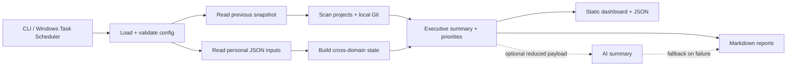

# Personal OS

[](https://github.com/PHENOMVALENCE/Personal-OS/actions/workflows/ci.yml)


**Personal OS** is a local-first operating layer for personal execution. It turns software-project activity plus manually maintained life inputs into structured executive reports, morning briefings, end-of-day reviews, and a private browser dashboard.

It is intentionally lightweight: dependency-free Node.js modules, local JSON inputs, local Git inspection, static output, and Windows PowerShell automation. Optional AI summaries are disabled by default.

## Why this exists

Most personal productivity tools only track tasks. Personal OS is designed to answer a wider operational question: **what changed, what needs attention, and what should happen next?**

It combines two signal groups:

- **Project intelligence** — file deltas, Git activity, changed areas, TODO/FIXME markers, feature/fix signals, and pending work.
- **Personal operations** — schedule, academics, communications, responsibilities, finance, and goals.

The result is one recurring operating picture rather than several disconnected checklists.

## Current capabilities

### Project monitoring

- Inventory immediate child projects under one configured workspace.
- Compare file size and modification time between scans.
- Read local Git branch, working-tree status, recent commits, and last commit.
- Classify changed files into frontend, backend, API, database, config, tests, docs, assets, and other.
- Extract TODO/FIXME/HACK/XXX markers from configured text-file types.
- Surface heuristic feature, fix, churn, and pending-work signals.
- Apply deterministic project ordering and exact/path-prefix directory exclusions.

### Personal operations

- Summarize today's schedule and detect direct overlaps.
- Track academic deadlines and overdue work.
- Surface pending and high-priority communication follow-ups.
- Track responsibility areas, upcoming work, and overdue commitments.
- Track upcoming bills and financial goals.
- Include longer-term goals in the dashboard and reports.

### Reporting and automation

- Generate a three-hour executive report.
- Generate morning and end-of-day briefings.
- Generate a static local HTML dashboard plus JSON snapshot.
- Store timestamped scan history for later inspection.
- Register recurring Windows Task Scheduler jobs.
- Optionally show desktop notifications and open generated output.

### Safety and privacy

- Local configuration, inputs, state, reports, and dashboard output are ignored by Git.
- Optional AI processing requires both explicit configuration and `OPENAI_API_KEY`.
- AI requests use a bounded timeout and only receive a reduced project summary rather than full file inventories.
- The dashboard has no server, public endpoint, or built-in authentication.

## Architecture



Core runtime modules:

| Module | Responsibility |
| --- | --- |
| `src/cli.js` | Command dispatch and user-facing CLI output |
| `src/core/config.js` | Configuration loading, validation, and path normalization |
| `src/core/projects.js` | Project traversal, Git inspection, change classification, TODO signals |
| `src/core/domains.js` | Schedule, academics, communications, responsibilities, finance, goals |
| `src/core/system.js` | Executive metrics, actions, and deterministic recommendations |
| `src/core/reporting.js` | Snapshots, reports, dashboard, reduced AI payload |
| `src/core/llm.js` | Optional bounded external summary request |

## Quick start

Requirements: **Node.js 22+** and **Git**. Windows scheduling additionally requires PowerShell.

```powershell
git clone https://github.com/PHENOMVALENCE/Personal-OS.git
cd Personal-OS
npm run setup
```

Edit `config/personal-os.config.json` and point `workspaceRoot` to the parent directory containing the projects you want to monitor.

```json
{
  "workspaceRoot": "C:\\Projects"
}
```

Then run:

```powershell
npm run scan
```

Open `dashboard/index.html` and inspect `reports/latest-three-hour.md`. The first run establishes a baseline; later scans show actual deltas.

To register recurring Windows tasks after confirming a manual scan works:

```powershell
powershell -NoProfile -ExecutionPolicy Bypass -File .\scripts\register-tasks.ps1
```

Read [operations](docs/OPERATIONS.md) before changing an existing scheduled installation.

## Commands

| Command | Result |
| --- | --- |
| `npm run setup` | Create missing local configuration and private input files |
| `npm run scan` | Scan projects, update state, write executive report and dashboard |
| `npm run briefing:morning` | Scan and write the morning briefing |
| `npm run briefing:eod` | Scan and write the end-of-day review |
| `npm run dashboard` | Refresh the current dashboard and report state |
| `npm run report:all` | Scan once and produce all report types |
| `npm run check` | Parse JavaScript source, scripts, and tests |
| `npm test` | Exercise the workflow in a temporary synthetic workspace |

## Local data boundary

The following are intentionally private runtime artifacts and are excluded from version control:

```text
config/personal-os.config.json
data/inputs/
data/state/
data/history/
reports/
dashboard/
```

Do not force-add them. Reports can contain project paths, commit subjects, TODO excerpts, contacts, obligations, and financial context. Review [SECURITY.md](SECURITY.md) before enabling optional external processing.

## Project status

This repository is an early local tool, not a hosted personal-data platform. Current limits include:

- file comparison is based on size + modification time rather than content hashes;
- project `.gitignore` rules are not automatically applied;
- malformed personal input structures can still fail downstream processing;
- writes are not transactional and concurrent scans are not yet locked;
- end-of-day reporting reflects the latest scan delta rather than a full-day aggregate;
- service integrations such as Gmail, Calendar, WhatsApp, and remote GitHub activity are not implemented.

See the [roadmap](docs/ROADMAP.md) for planned reliability and integration work.

## Documentation

- [Getting started](docs/GETTING_STARTED.md)
- [Configuration reference](docs/CONFIGURATION.md)
- [Input formats](docs/INPUTS.md)
- [Architecture and data flow](docs/ARCHITECTURE.md)
- [Operations, scheduling, backups, troubleshooting](docs/OPERATIONS.md)
- [Security and privacy boundaries](SECURITY.md)
- [Contributing and validation](CONTRIBUTING.md)
- [Roadmap](docs/ROADMAP.md)
- [Changelog](CHANGELOG.md)

## License

No open-source license has been granted yet. A public GitHub repository does not by itself grant general reuse rights.
