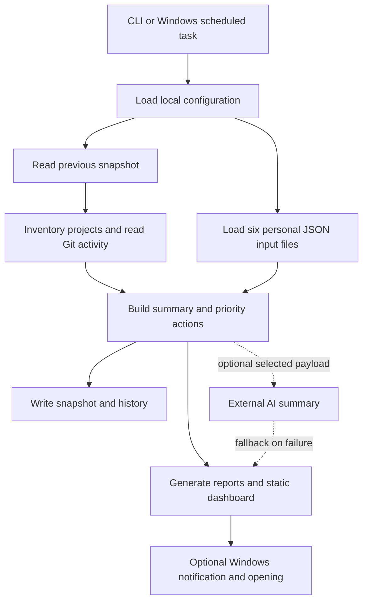

# Architecture

## Execution model

Personal OS is a command-line batch application. Each invocation reads local configuration, scans projects and personal input files, writes artifacts, and exits. Windows Task Scheduler supplies recurring execution. GitHub Actions validates public source; it does not execute your personal monitoring schedule.

## Module responsibilities

| Module | Responsibility |
| --- | --- |
| `src/cli.js` | Dispatch `scan`, `morning`, `eod`, `dashboard`; print artifact locations and set failure exit status. |
| `src/core/config.js` | Locate installation root, parse and validate configuration, normalize runtime paths, and verify the workspace. |
| `src/core/projects.js` | Traverse projects, compare inventories, run read-only Git commands, classify changes and extract TODO signals. |
| `src/core/domains.js` | Read personal inputs and derive due dates, priorities, schedule conflicts and follow-ups. |
| `src/core/system.js` | Combine project/domain state and build executive metrics, actions and recommendations. |
| `src/core/reporting.js` | Persist snapshots, Markdown reports, static HTML and dashboard JSON. |
| `src/core/llm.js` | Optional bounded external summary request with resilient output parsing and local fallback. |
| `src/core/utils.js` | Filesystem, JSON, date, text and priority helpers. |
| `scripts/common.ps1` | Invoke CLI modes and optionally notify/open results. |

## Project scanning

Every immediate child directory under `workspaceRoot`, except explicit exclusions, becomes a project. Project names and traversed entries are ordered deterministically. Symbolic links are skipped, and directory exclusions support exact relative paths plus path prefixes. Traversal stores relative file paths with byte size and modification time; it does not hash contents. A same-size edit preserving modification time can be missed, and a timestamp-only touch can count as a modification. Unreadable nested directories/files are skipped; an unreadable workspace root fails the scan.

Snapshots are matched by project name. First-run baselines suppress file-change counts. Later runs compare created, modified and deleted file paths. Potential renames pair new and deleted files by basename; this is not Git rename detection. Removed top-level projects are absent from the new result rather than represented as deleted projects.

For projects with a `.git` entry, synchronous read-only Git commands collect branch, short status, latest commit and commits since the previous snapshot timestamp. With no previous timestamp, up to five commits are included. Git errors produce empty fields. No pull, push, commit or fetch occurs during scans.

Change categories follow filename/path rules with precedence. TODO extraction reads only created/modified files whose suffix matches configured `textExtensions` and stops at the per-project limit. Baseline scans do not inventory all existing TODOs. Feature and fix statements derive from commit keywords and file categories; they do not prove correctness, deployment, or completion.

## Domain summaries

Inputs are read from `data/inputs` under the installation root. Missing or malformed JSON falls back to empty data; structurally invalid values can still fail downstream processing. Academic due-soon items use seven days. Schedule upcoming items use 24 hours. Completed tasks require the exact status `done`; paid bills require `paid`. Communication priority uses `high`, `medium`, `low`.

## Persistence and failure behavior

`latest-snapshot.json` and timestamped history are written before report generation. Reports and dashboard are then written as separate files, without a transaction or process lock. A later write failure can leave a new baseline with older reports; overlapping invocations can race. There is no retention policy. Back up inputs, configuration and state separately from the public repository.

Morning/evening commands perform new scans and update the baseline. The end-of-day report summarizes the latest scan delta rather than aggregating a full day's history. Running commands consecutively can therefore produce a quiet end-of-day review even after earlier activity.

The dashboard has no backend, authentication, live polling or interactive editing. It is regenerated from the latest scan, and generated content should be treated as private local output.
